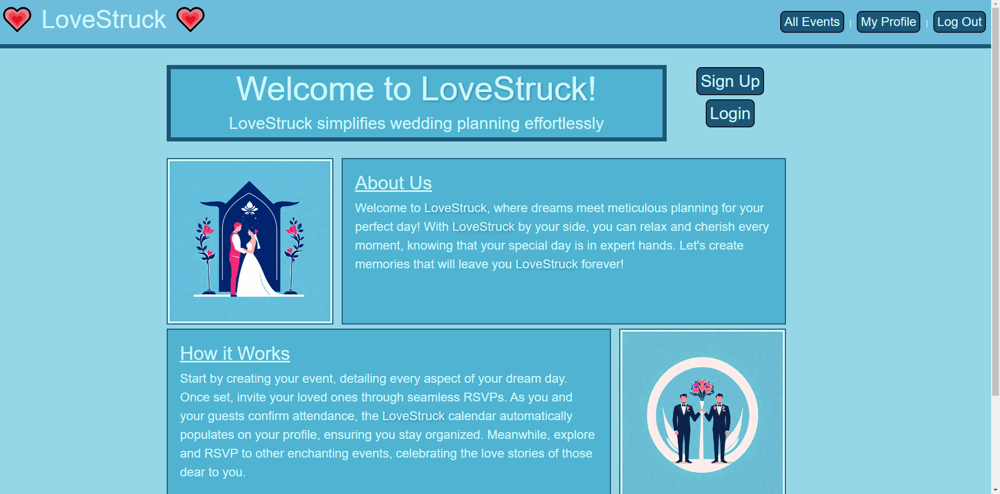

# Lovestruck

  ## Description

  LoveStruck is an online RSVP platform designed to streamline the process of managing wedding guest confirmations. In the era of digital solutions for almost every aspect of life, LoveStruck RSVP stands out as a beacon for couples embarking on the journey of marriage. Our motivation for this project was born from the complexities and often tedious task of tracking who will be joining the couple on their special day. We sought to create a tool that not only saves time but also brings a level of joy and ease to wedding planning.

  Through this application, we solved the all-too-common problem of managing an ever-changing guest list. LoveStruck ensures that all invitations are accounted for, responses are tracked, and no one is accidentally left out. Building this project from the ground up has been a tremendous learning opportunity, allowing us to dive deep into the MERN stack, explore the intricacies of GraphQL, and refine our understanding of responsive web design principles. We emerged from this experience not only with a robust application but with enriched knowledge and new perspectives on full-stack development. 
  
  ## Table of Contents
  
  - [Installation](#installation)  
  - [Usage](#usage)  
  - [License](#license)  
  - [Features](#features)  
  - [NPMs](#npms)    
  - [Contributing](#contributing)  
  - [Questions](#questions)  
  
  ## Installation
  
 Run:  
 ``npm i``  
 ``npm run develop``

 or visit link at
 <!-- TODO: insert deployed app -->
 [Lovestruck]("")
  
  ## Usage
  
  1. Sign up for an account and log in
  2. Once signed in, you can: 
      A. Create an event 
      B. RSVP to an existing event
        - Add a +1, view event details
        - Choose meal option 
        - Donate to the 'Honeypot'.
        
  View Demo Video: <!-- TODO: insert Demo Video (and screenshots?)-->
  
  ## License
  
  This project is licensed under the [MIT License](LICENSE.md)

  ## Features

  - User account creation and authentication
  - Event creation with customizable details
  - Real-time RSVP tracking
  - Interactive calendar view
  - Responsive design for mobile and desktop devices

  ## NPMs  
  [Vite](https://www.npmjs.com/package/vite)   
  [Apollo/Client](https://www.npmjs.com/package/@apollo/client)  
  [Apollo/Server](https://www.npmjs.com/package/@apollo/server)  
  [React](https://www.npmjs.com/package/react) (Including the react-dom and react-router-dom)    
  [JWT](https://www.npmjs.com/package/jsonwebtoken)  
  [GraphQL](https://www.npmjs.com/package/graphql)  
  [MonGoose](https://www.npmjs.com/package/mongoose)  

  ## Contributing
  
 - Make event private to creator and invited guests
 - Add hotel reservations and travel information
 - Adding a gift registry section where guests can see and select gifts for couple
 - Integrating external APIs to offer additional services like accommodation booking or navigationto the event venue
 - Accomodation of a broader range of events other than just weddings 

  
  ## Questions
  
  For any questions, please contact me:
  
  GitHub:
  * [Devin Shade]("https://github.com/devinshade") 
  * [Tyler Fruik]("https://github.com/tylerFruik")
  * [Lizzie Bumpers]("https://github.com/laude-noctis")
  * [Deborah Hariharan]("https://github.com/Luwylbab")
  * [Luke Babers]("https://github.com/Luwylbab")

  ## Screenshot
  
  